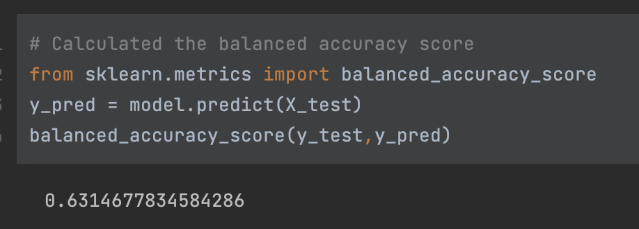
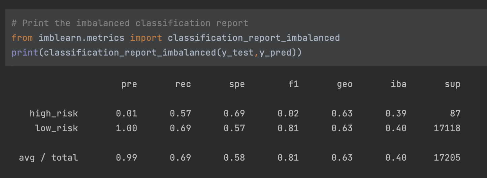

# Credit Risk Analysis

## Overview 
Credit risk is a unbalanced classification problem. Most loans are good but the failed ones can be costly. Six different techniques will be used to train and evaluate models to assess credit risk data. 

Machine Learning Models Used 
1. RandomOverSampler  (over sampler) 
2. SMOTE (over sampler) 
3. ClusterCentroids (undersampler) 
4. SMOTEENN (combination) 
5. Balanced Random Forest 
6. EasyEnsembleClassificer 

## Purpose & Approach 
**For each of the 6 models:**
1. Creating training variables as need by converting strings to numerical and assessing for missing values etc. 
2. Create target variables and split into training and testing 
3. Check the balance of target variables 
4. Train the model 
5. Assess the model using 
	1. Balanced accuracy score 
	2. Confusion Matrix 
	3. Imbalanced Classification Report 
6. Use the assessments make some determinations of the various models. 

## Results 

### RandomOverSampler  (over sampler) 

1. Balanced Accuracy: .6314677 
2. Precision High Risk: .01 
3. Precision Low Risk: 1.0 
4. Recall High Risk: .57 
5. Recall Low Risk: .69 

### SMOTE (over sampler) 

1. Balanced Accuracy: .6268316 
2. Precision High Risk: .01 
3. Precision Low Risk: 1.0 
4. Recall High Risk: .61
5. Recall Low Risk: .64

### ClusterCentroids (undersampler) 

1. Balanced Accuracy: .5209851  
2. Precision High Risk: .01 
3. Precision Low Risk: 1.0 
4. Recall High Risk: .60
5. Recall Low Risk: .44 

### SMOTEENN (combination) 

1. Balanced Accuracy: .623555 
2. Precision High Risk: .01 
3. Precision Low Risk: 1.0 
4. Recall High Risk: .71
5. Recall Low Risk: .53

### Balanced Random Forest

1. Balanced Accuracy: .7877672 
2. Precision High Risk: .04
3. Precision Low Risk: 1.0 
4. Recall High Risk: .67
5. Recall Low Risk: .91 

##### List of features from high to low 

### EasyEnsembleClassificer  

1. Balanced Accuracy: .92542735
2. Precision High Risk: .07
3. Precision Low Risk: 1
4. Recall High Risk: .91
5. Recall Low Risk: .94

## Summary 
The EasyEnsembleClassifer model had the best balanced accuracy score of .93. Other models has os score of below .80. The recall score were also considerably better with this model with a high/low recall score of .91/.94. Finally the precision for the high risk was better than any of the models even though it was just .07. 

Unbalanced data is an issue especially when looking to avoid risk. Using and evaluating several machine models is important to help minimize the risk as much as possible. Also it goes without saying that domain knowledge is critical in taking a look at the model output to ensure domain expertise can be documented so anyone using the model has that perspective along with the data. 
